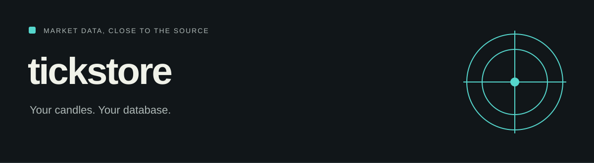

# tickstore

<!-- repo-badges:start -->
<div align="center">

[](https://github.com/honeyamn10-source/tickstore/stargazers)
[](https://github.com/honeyamn10-source/tickstore/forks)
[](https://github.com/honeyamn10-source/tickstore/issues)
[](https://github.com/honeyamn10-source/tickstore/commits/main)
[](https://github.com/honeyamn10-source/tickstore/blob/main/LICENSE)

[Repository](https://github.com/honeyamn10-source/tickstore) · [Issues](https://github.com/honeyamn10-source/tickstore/issues) · [Pull Requests](https://github.com/honeyamn10-source/tickstore/pulls) · [Actions](https://github.com/honeyamn10-source/tickstore/actions)

</div>
<!-- repo-badges:end -->

<!-- professional-meta:start -->
<div align="center">

[](https://github.com/honeyamn10-source/tickstore/actions/workflows/ci.yml) [](https://github.com/honeyamn10-source/tickstore/actions/workflows/codeql.yml)

  

[Documentation](docs) · [Examples](examples) · [Contributing](CONTRIBUTING.md) · [Security](SECURITY.md) · [Changelog](CHANGELOG.md)

</div>
<!-- professional-meta:end -->


Fetch OHLCV market data, keep it in SQLite, and compute indicators with a Python library built on the standard library.

[Project website](https://honeyamn10-source.github.io/tickstore/) · [Source](https://github.com/honeyamn10-source/tickstore) · [Build results](https://github.com/honeyamn10-source/tickstore/actions) · [Issues](https://github.com/honeyamn10-source/tickstore/issues)

## What it does

- **Collect.** Binance and Yahoo provider adapters supply OHLCV candles.
- **Store.** Local SQLite storage keeps the series available to your own research tools.
- **Calculate.** Resampling and SMA, EMA, RSI, ATR, Bollinger band and VWAP helpers.

## Start from source

Python 3.9 or later. Network access is required for provider downloads.

```bash
git clone https://github.com/honeyamn10-source/tickstore.git
cd tickstore
python -m pip install .
tickstore fetch BTCUSDT --exchange binance --interval 1h --limit 100 --save
tickstore status BTCUSDT --interval 1h
tickstore indicators BTCUSDT --interval 1h --sma 20 --rsi 14
```

## Check your changes

```bash
python -m pip install -e ".[dev]"
python -m pytest
```

These are the repository’s checks, not a claim of complete test coverage. See [GitHub Actions](https://github.com/honeyamn10-source/tickstore/actions) for the result on a specific commit.

## Scope and limitations

This stores candle data, not an exchange tick feed. Provider availability, rate limits and data quality vary; it does not execute trades.

## Find your way around

| Source | Purpose |
| --- | --- |
| [`tickstore/providers.py`](tickstore/providers.py) | Provider adapters |
| [`tickstore/store.py`](tickstore/store.py) | SQLite storage |
| [`examples/quantlab.py`](examples/quantlab.py) | Research example |

## Contributing

Include the command you ran, your runtime version, a minimal reproduction and the expected result in an issue. Remove credentials and personal data from logs. Follow [CONTRIBUTING.md](CONTRIBUTING.md) when proposing a change.

## License

MIT — see [LICENSE](LICENSE). Third-party dependencies retain their own licenses.
