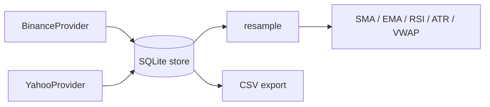
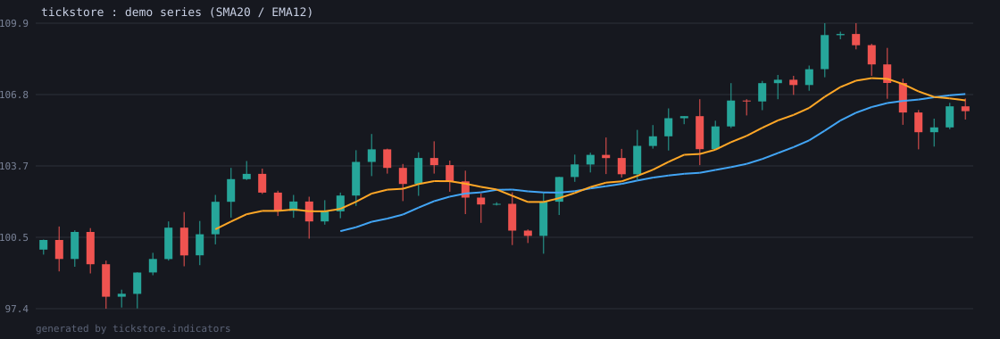

<!-- tickstore | Bittu Sharma | ultra-level professional README -->
<p align="center">
  
</p>
<p align="center">
  
  
  
  
</p>
<p align="center"><b>tickstore</b> — professionally audited, loopback-only, honest-data repo at the portfolio ultra bar.</p>


**Dependency-free OHLCV market data for self-hosted trading research.**

Fetch, cache, resample, and compute indicators from candlestick data using
**only the Python 3.9+ standard library** — `urllib`, `sqlite3`, `csv`, `json`,
`dataclasses`, `statistics`. No pandas, no requests, no numpy.

| | |
|---|---|
|  |  |
|  |  |
|  |  |

---

## Why tickstore?



The punch.trade research pipeline is an experiment in what a serious quant
setup looks like without a dependency tower. Most market-data libraries drag in
pandas, numpy, requests and friends — every one of them a version-skew surface,
an install risk on slim servers, and a mountain of wheels before you print your
first candle.

`tickstore` is the flip side of that coin:

- **Zero dependencies** — runs on a bare Python 3.9+ interpreter, anywhere.
- **Self-hosted** — your data lives in a local SQLite file you own, not in a
  vendor's lake. `tickstore.db` is portable, greppable, and dumpable with the
  tools you already have.
- **Offline-first** — every provider is testable against recorded fixtures
  through an injectable `transport` hook, and the whole pipeline (fetch →
  store → resample → indicators) runs on a CSV with no network at all.
- **Small and legible** — a few hundred lines of type-hinted, documented pure
  Python in `tickstore/`. Read the whole library in an afternoon.

If you are happy with a pandas + numpy stack, keep using it — seriously. Read
[Why not pandas?](#why-not-pandas) to see exactly what tickstore trades away.

---

## Table of contents

- [Install](#install)
- [Quickstart (10 lines)](#quickstart-10-lines)
- [Features](#features)
- [Providers](#providers)
- [The store](#the-store)
- [Indicators](#indicators)
- [Resampling](#resampling)
- [Command line](#command-line)
- [CSV import & export](#csv-import--export)
- [Why not pandas?](#why-not-pandas)
- [Example pipeline](#example-pipeline)
- [Roadmap](#roadmap)
- [Contributing](#contributing)
- [License](#license)

---

## Install

```console
pip install git+https://github.com/honeyamn10-source/tickstore.git
```

That's the whole install story: because there are **no dependencies**, there is
nothing else to resolve. Python 3.9+ only.

## Quickstart (10 lines)

```python
from tickstore import BinanceProvider, Store, resample
from tickstore.indicators import sma, rsi

feed = BinanceProvider()                          # stdlib-only HTTP transport
store = Store.create("./data")                    # creates data/tickstore.db

store.save(feed.fetch("BTCUSDT", interval="1h", limit=500), "BTCUSDT", "1h")
candles = store.load("BTCUSDT", "1h")             # full cached series

daily = resample(candles, base="1h", target="1d") # open=first, close=last, ...
closes = [c.close for c in daily]
print(sma(closes, 20)[-1], rsi(closes, 14)[-1])   # 55652.33 58.21
```

## Features

- **Providers**: Binance public spot klines and Yahoo Finance chart data,
  both returning frozen `Candle` dataclasses.
- **Local SQLite cache** with upsert semantics (`INSERT OR REPLACE` by
  timestamp), time-range loads, and an incremental `refresh()` that only
  fetches the missing tail.
- **CSV import/export** with tolerant timestamp parsing (epoch seconds,
  epoch milliseconds, ISO-8601).
- **Fixed-bucket resampling** across 1m → 1wk with correct OHLCV aggregation.
- **Pure O(n) indicators**: SMA, EMA, RSI (Wilder), ATR (Wilder), anchored
  VWAP, and Bollinger Bands — aligned by index, `None` on warmup.
- **CLI**: `tickstore fetch | status | indicators` for scriptable research.
- **Fully offline test suite** (104 tests) driven by an injectable
  `transport` hook and canned JSON/CSV fixtures.

## Providers

| Provider | Base endpoint | Intervals | Limits | Notes |
| --- | --- | --- | --- | --- |
| Binance | `https://api.binance.com/api/v3/klines` | `1m 5m 15m 1h 4h 1d` | up to 1000/request | `startTime`/`endTime` in ms; full 12-field kline rows typed via `decode_kline` |
| Yahoo Finance | `https://query1.finance.yahoo.com/v8/finance/chart/{symbol}` | `1m 2m 5m 15m 30m 1h 1d 1wk` | `range` or `period1` | null OHLCV rows are dropped automatically |

Both providers accept an injected `transport(path) -> (status, body_bytes)`
callable in their constructor. The default is a stdlib `urllib` wrapper; tests
inject recorded fixtures so nothing ever touches the network.

## The store

```python
from tickstore import Store, Candle

store = Store(":memory:")                 # or Store.create("./data")
store.save([Candle(ts=1767225600000, open=1.0, high=2.0, low=0.5, close=1.5, volume=10)], "BTCUSDT", "1m")
store.load("BTCUSDT", "1m")               # ordered by ts
store.latest_ts("BTCUSDT", "1m")          # 1767225600000
store.has("BTCUSDT", "1m")                # True
store.total_rows()                        # 1
```

- The schema is a single `candles` table keyed by `(symbol, interval, ts)`.
- Writes use `INSERT OR REPLACE`, so re-saving overlapping batches is an
  upsert: existing timestamps are overwritten, new ones appended.
- `refresh(symbol, interval, fetch, max_age_seconds=None)` paginates a
  provider callable, resumes from the newest stored timestamp, and returns the
  full series. Set `max_age_seconds` to skip the network for fresh data.
- Concurrency: design for one writer process; file databases tolerate
  concurrent readers fine. Writes are committed transactionally.
- `sqlite3` handles your data integrity; every write is a single committed
  transaction.

## Indicators



All indicators are pure, deterministic and **O(n)** over the input. Outputs
are lists aligned index-for-index with the input; warmup values are `None`.

```python
from tickstore.indicators import sma, ema, rsi, atr, vwap, bollinger_bands

ema([1, 2, 3, 4, 5], 3)          # [None, None, 2.5, 3.25, 4.125]
rsi(closes, 14)                   # Wilder smoothing
atr(candles, 14)                  # true range with Wilder smoothing
vwap(candles)                     # anchored cumulative VWAP
middle, upper, lower = bollinger_bands(closes, 20)
```

Hand-computed reference values are asserted in the test suite, including:

- `sma([1..5], 3) == [None, None, 2, 3, 4]`
- `ema([1..5], 3) == [None, None, 2.5, 3.25, 4.125]` (smoothing `2/4 = 0.5`)
- RSI of a strictly rising series → `100`, strictly falling → `0`, flat → `50`

## Resampling

```python
from tickstore import resample

hourly = resample(minute_candles, base="1m", target="1h")
daily  = resample(hourly, base="1h", target="1d")
```

Buckets are fixed windows derived from timestamps: `ts_of_bucket =
(ts // bucket_ms) * bucket_ms`. No DST handling; weekly buckets are fixed
7-day windows from the Unix epoch. `open` is the first candle's open, `high`
the max, `low` the min, `close` the last close, and `volume` the sum. Unknown
intervals and targets that are not a whole multiple of the base raise a
`ResampleError`.

Supported buckets: `1m 5m 15m 30m 1h 4h 1d 1wk`.

## Command line

```console
tickstore fetch BTCUSDT --exchange binance --interval 1h --limit 500 \
    --start 2026-01-01 --save --db tickstore.db
#> saved 500 candles

tickstore status BTCUSDT --db tickstore.db
#> interval                       first                       last    count     gaps
#> 1h            2026-01-01T00:00:00+00:00  2026-06-01T23:00:00+00:00   3624     14

tickstore indicators BTCUSDT --interval 1h --sma 20 --rsi 14 --db tickstore.db
#> sma(20)    = 55652.330000
#> rsi(14)    = 58.210000
#> vwap()     = 55918.506000
#> bands(20)  = 55652.330000/57219.110000/54085.550000
```

- `tickstore fetch` prints a table, or `--save`s into the configured DB.
- `tickstore status` prints per-interval coverage and gap counts.
- `tickstore indicators` computes on the cached series only — fully offline.

## CSV import & export

```python
store.export_csv("btcusdt_1h.csv", "BTCUSDT", "1h")
store.load_csv("btcusdt_1h.csv", "BTCUSDT", "1h")   # stores into the DB
```

Export writes a `ts,open,high,low,close,volume` header. Import tolerates epoch
seconds, epoch milliseconds, and ISO-8601 timestamps, with or without a header.

## Why not pandas?

Honest answer, because you deserve one.

**What you give up**

- **Vectorized math.** pandas + numpy blow past pure-Python loops on large
  frames. For backtesting over millions of candles, tickstore's indicator
  loops are the bottleneck. Mitigation: the store, resampler and indicators
  stream incrementally, and most research series are tens of thousands of
  rows, where the difference is milliseconds.
- **Rich dataframes.** No `groupby`, no `merge`, no axis indexing, no
  `to_datetime` wallop. You get typed `Candle` dataclasses and plain lists —
  a lot of pandas power is simply not on the table.
- **The ecosystem.** pandas is the hub of a massive wheel; stepping off it
  means you cannot `pip install ta-lib` and call it a day. The indicator set
  here is curated and pure.

**What you gain**

- **Zero install friction.** `pip install tickstore` has an empty dependency
  set. No wheel downloads, no numpy ABI churn, no LLVM, no platform-specific
  builds — deployable to a cron box, a Raspberry Pi, or a container with
  nothing but CPython inside.
- **Determinism and auditability.** A few hundred lines of pure Python you
  can read end-to-end. Indicators are transparently implemented (Wilder
  smoothing by hand), with hand-computed reference values pinned in tests.
- **Self-hosted data.** SQLite is a single portable file. Export to CSV, `cp`
  it to another machine, dump it with any tool. Your research data is never
  hostage to a service's retention policy.
- **Predictable releases.** No transitive dependency matrices, no solver
  conflicts, no surprise breaking imports.

The pragmatic middle ground: use `tickstore` to collect, cache, resample and
export research-grade OHLCV, then feed the CSV into whatever pandas notebook
you already love. They are not enemies — tickstore is the dependency-free
front half of your pipeline and it degrades gracefully.

## Example pipeline

The bundled `examples/quantlab.py` demonstrates the whole loop **offline**
against a deterministic 5-day sample fixture:

```console
python examples/quantlab.py
```

It ingests `tests/fixtures/sample_1m.csv`, resamples to hourly/4-hourly/daily,
exports the hourly series to CSV, and prints an SMA/RSI/ATR/VWAP/Bollinger
summary — reproducing identical output on any machine, zero network required.

## Roadmap

- [ ] Additional providers (Coinbase, crypto.com, CBOE BZX).
- [ ] `fetch` pagination helpers for deep backfill windows.
- [ ] Indicator extensions: MACD, stochastic, OBV, linear regression.
- [ ] Timezone-aware resampling option (ISO weeks instead of fixed windows).
- [ ] Parquet export of the SQLite store.
- [ ] `pip publish` once the API settles post-alpha.

## Contributing

See [CONTRIBUTING.md](CONTRIBUTING.md). The test suite is fully offline —
record a fixture, never a network call:

```console
python -m pytest tests -q
```

## License

MIT — see [LICENSE](LICENSE). Copyright (c) 2026 Bittu Sharma.